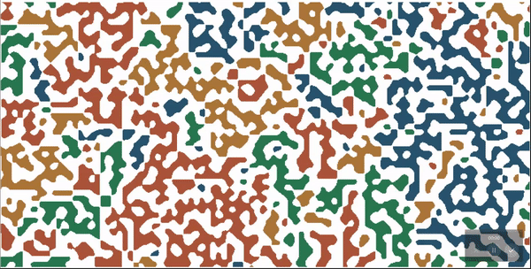

# contagion

This is a small python project that uses pygame to draw a color 'contagion' to fill a randombly generated background. The background is generated using random perlin noise.

### Example
